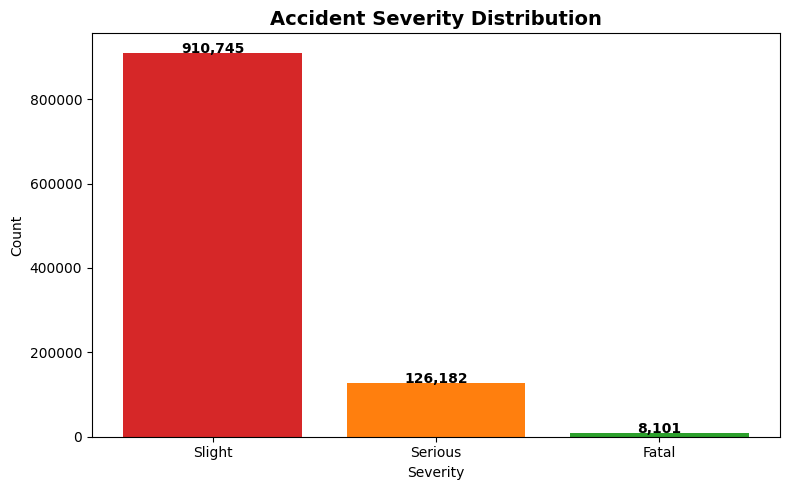
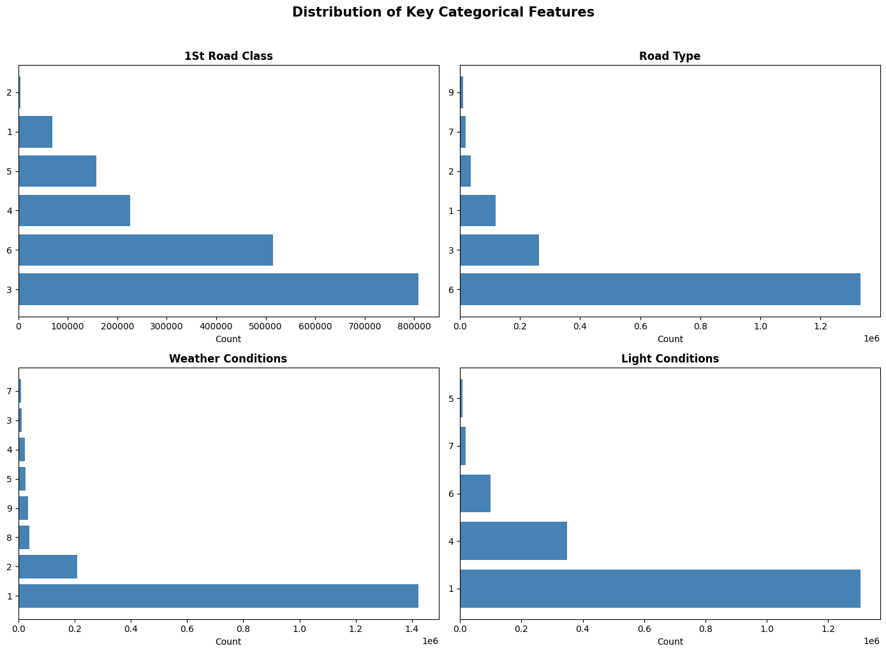
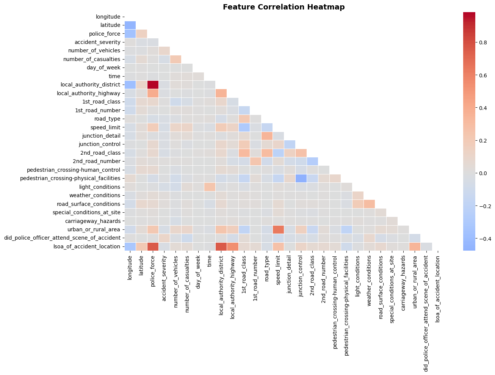
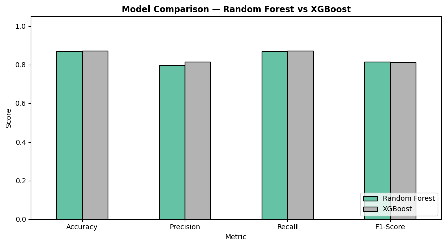
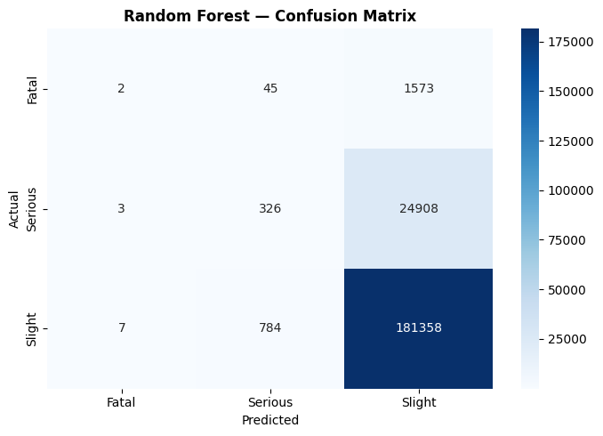
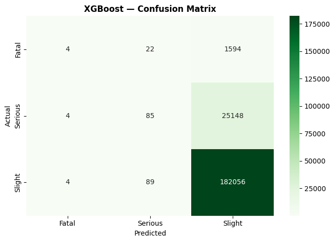
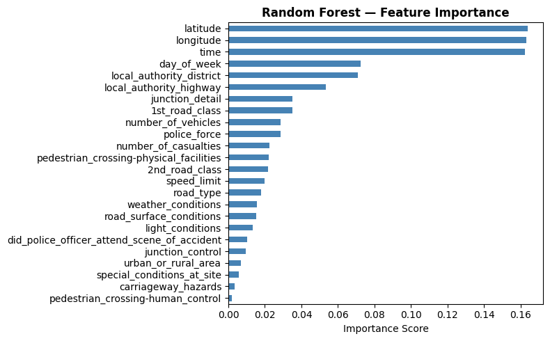

# 🚗 Road Accident Severity Prediction

> Predicting road accident severity (Fatal / Serious / Slight) using machine learning on 1M+ UK road accident records.

---

## 📌 Problem Statement

Road accidents are a leading cause of fatalities worldwide. Being able to predict the **severity of an accident** based on road, weather, and environmental conditions can help:

- 🚑 Emergency services pre-position resources in high-risk zones
- 🛣️ Road authorities prioritize infrastructure improvements
- 📋 Insurance companies assess risk profiles more accurately

---

## 📂 Dataset

- **Source:** [UK Road Accidents Dataset — Kaggle](https://www.kaggle.com/datasets/silicon99/dft-accident-data)
- **Size:** 1,000,000+ records | 30+ features
- **Target:** `accident_severity` → Fatal (1), Serious (2), Slight (3)

---

## 🔍 Exploratory Data Analysis

### Accident Severity Distribution

> Dataset is heavily imbalanced — Slight accidents (910,745) dominate over Serious (126,182) and Fatal (8,101). This is realistic but poses a challenge for model training.

### Distribution of Key Categorical Features

### Feature Correlation Heatmap

---

## ⚙️ Methodology

| Step | Details |
|------|---------|
| Data Cleaning | Handled missing values, replaced -1 codes, normalized column names |
| Encoding | Label encoding for categorical features |
| Feature Selection | LinearSVC with L1 penalty to reduce dimensionality |
| Models | Random Forest, XGBoost |
| Evaluation | Accuracy, Precision, Recall, F1-Score, Confusion Matrix |

---

## 🤖 Models & Results

### Model Comparison

| Model | Accuracy | Precision | Recall | F1-Score |
|-------|----------|-----------|--------|----------|
| Random Forest | 86.93% | 79.58% | 86.93% | 81.36% |
| XGBoost | **87.15%** | **81.48%** | **87.15%** | 81.25% |

> XGBoost achieves slightly higher accuracy and precision. Random Forest offers better interpretability via feature importance.

---

## 🔥 Confusion Matrices

| Random Forest | XGBoost |
|---|---|
|  |  |

---

## 📊 Feature Importance

> **Latitude, Longitude, and Time** are the strongest predictors — accident location and timing matter most. Road class, junction detail, and weather conditions also play a significant role.

---

## 💡 Key Findings

1. **Class imbalance is the core challenge** — Fatal accidents are rare (0.77%) but most critical to predict correctly
2. **Both models perform comparably (~87%)** — XGBoost edges ahead on accuracy and precision
3. **Location features dominate** — latitude, longitude, and time of day are the top predictors
4. **Weather and road conditions matter** — light conditions, weather, and road surface all contribute meaningfully

---

## 🚀 Future Work

- Apply **SMOTE** oversampling to improve recall for Fatal/Serious classes
- Try **LightGBM** or **CatBoost** for further performance gains
- Add **SHAP explainability** for individual prediction interpretation
- Deploy as a **REST API** for real-time accident severity prediction

---

## 🛠️ Tech Stack

---

## 👩‍💻 Author

**Nupur Srivastava**
[![www.linkedin.com/in/nupur-srivastava-5456131a3)

